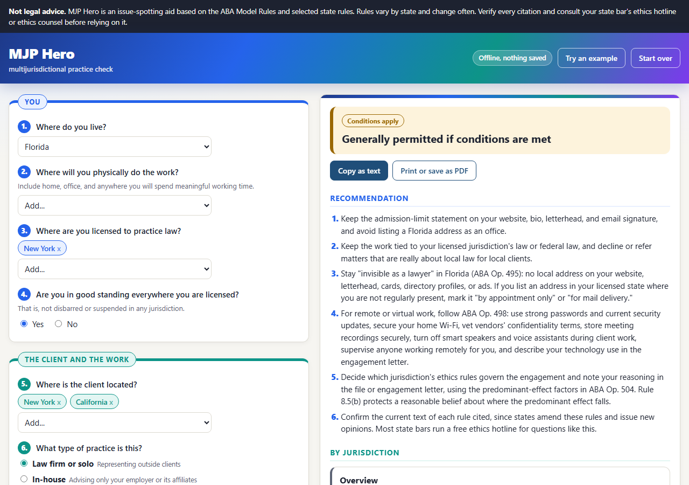

# MJP Hero

**Can you practice law there?** MJP Hero is a free, offline issue-spotter for a lawyer's multijurisdictional practice. Answer 14 questions about where you live, where you work, where you are licensed, and where your client is, and it gives you a recommendation with citations to the rules of professional conduct that apply.

**[Try it in your browser](https://nkostelnik.github.io/mjp-hero/)** · [See an example](https://nkostelnik.github.io/mjp-hero/#demo) · [Download the single-file version](https://github.com/nkostelnik/mjp-hero/releases/latest)

> **Not legal advice.** MJP Hero is an issue-spotting aid. Rules vary by state and change often. Verify every citation and consult ethics counsel or your state bar's ethics hotline before relying on it.

## What it asks

1. Where do you live?
2. Where will you physically do the work?
3. Where are you licensed?
4. Are you in good standing everywhere you are licensed?
5. Where is the client located?
6. What type of practice is this? (law firm, in-house, fractional or staffing-agency counsel, federal practice, government)
7. Whose law does the work mainly involve? (including "many states" for in-house contract work)
8. Is it a one-time matter or ongoing work?
9. Where do you have an office, public address, or advertising? (or none)
10. Do your website, bio, letterhead, and signature state where you are admitted?
11. Is there a pending or expected proceeding? (court, arbitration, or mediation)
12. Where is it?
13. What is your pro hac vice status?
14. Are you working with locally admitted counsel?

## What you get

- **An overall verdict:** generally permitted, conditions apply, or likely problem.
- **A recommendation** with concrete next steps, such as adding an "Admitted only in" statement, registering as in-house counsel, seeking pro hac vice admission, or associating local counsel.
- **A finding for every jurisdiction your facts touch**, each with the rules behind it.
- **A list of every authority cited.** State citations link to the source they were checked against.
- **Copy as text** or **print / save as PDF** for your file.

## What it covers

**ABA baseline (every jurisdiction)**

- Model Rule 5.5: local office and systematic presence, holding out, the four temporary-practice safe harbors in 5.5(c), and in-house and federal practice under 5.5(d)
- Model Rule 8.5: disciplinary authority and choice of law
- Model Rules 7.1 (communications) and 1.1 (competence)
- ABA Formal Op. 495 (lawyers working remotely): the "invisible as a lawyer" test, no local address, and listing your licensed-state address "by appointment only" or "for mail delivery"
- ABA Formal Op. 498 (virtual practice): confidentiality, technology, and supervision steps for remote work
- ABA Formal Op. 504 (choice of rule): predominant-effect factors under Rule 8.5(b)
- ABA Formal Op. 88-356 (temporary lawyers): conflicts and fee arrangements for staffing-agency placements
- *Sperry v. Florida*, 373 U.S. 379 (1963), for federally authorized practice

**State-specific rules for 10 jurisdictions**

| State | Remote work from the state | In-house counsel | Also flags |
| --- | --- | --- | --- |
| California | No Op. 495 equivalent | Cal. R. Ct. 9.46 | *Birbrower*; temporary practice (9.47, 9.48); arbitration (9.43) |
| New York | 22 NYCRR 523.5 | Part 522 | Judiciary Law § 470 office rule for nonresident NY lawyers; Part 523 |
| Texas | Rule 5.05(d) (2024) | 5.05(c), no registration | Pro hac vice (Rule XIX) |
| Florida | 318 So. 3d 538; Rule 4-5.5 cmt. | Chapter 17 | Three pro hac vice appearances per year |
| Illinois | None specific | S. Ct. R. 716 | Rule 707; ISBA Op. 22-03 (practicing Illinois law from elsewhere) |
| D.C. | Rule 49(c)(13), occasional only | | Rule 49 |
| New Jersey | Op. 59 / Op. 742 | R. 1:27-2 | RPC 5.5(b)(3)(iv) |
| Pennsylvania | None specific | B.A.R. 302 | B.A.R. 301; Joint Op. 2021-100 (practicing Pennsylvania law from elsewhere) |
| Massachusetts | Rule 5.5 cmt. [4A] (2024) | S.J.C. Rule 4:02(9) | |
| Virginia | LEO 1896 | Rule 1A:5 | Rule 1A:4 |

**Remote-work guidance for 17 more states**

| State | Authority | Position |
| --- | --- | --- |
| Missouri | Informal Ops. 2024-02, 2024-03 | **Rejects Op. 495.** Working from a Missouri home requires Missouri admission, and so does serving a Missouri company in-house from another state |
| Arizona | ER 5.5(d) | Permitted for federal, tribal, or licensed-state law; client notice and informed consent required |
| Colorado | RPC 5.5 cmt. [1] (2024); C.R.C.P. 205.1 | Permitted; working for a Colorado firm with a Colorado office likely needs a Colorado license |
| Connecticut | RPC 5.5(f) (2023) | Permitted; no Connecticut clients |
| Hawaii | RPC 5.5 cmt. [3] (2022) | Permitted |
| Maine | Ethics Op. 189 (2005) | Permitted |
| Michigan | Ethics Op. RI-382 (2021) | Permitted |
| Minnesota | RPC 5.5(d) | Permitted; must tell clients you are not licensed in Minnesota |
| New Hampshire | RPC 5.5(d) & cmt. 3 | Permitted |
| North Carolina | RPC 5.5; State Bar guidance (2021) | Permitted |
| Ohio | Prof. Cond. R. 5.5(d)(4) (2021) | Permitted; materials showing an Ohio location must say you are not admitted in Ohio |
| Rhode Island | RPC 5.5 cmt. [4] | Permitted; no in-person client meetings in Rhode Island |
| South Carolina | RPC 5.5 cmt. [4] (2023) | Permitted |
| Utah | Ethics Op. 19-03 (2019) | Permitted; no public office or soliciting Utah business |
| Vermont | RPC 5.5 cmt. [22] | Permitted |
| Washington | WSBA Advisory Op. 201601 | Permitted; Washington lawyers living elsewhere must designate a resident agent |
| Wisconsin | Formal Op. EF-21-02 (2021) | Permitted |

Other jurisdictions fall back to the ABA Model Rule with a note that the local version may differ.

State citations were checked against official or reliable sources on 2026-09-26 and 2026-10-01. A few well-known citations that were not checked show a **verify** tag in the app.

## Built to run anywhere, including locked-down work environments

- **No network access.** A Content-Security-Policy (`connect-src 'none'`) blocks all outbound requests. No external fonts, scripts, or analytics.
- **Nothing is saved.** No cookies or browser storage. Closing the tab erases your answers.
- **No install.** Plain HTML, CSS, and JavaScript. No server and no build step needed to use it.

To use it at work, download `mjp-hero.html` from the [latest release](https://github.com/nkostelnik/mjp-hero/releases/latest) and open it by double-click, or copy the whole folder to a shared drive or intranet server and open `index.html`.

## Development

Requires Node.js only for tests and builds.

| Command | What it does |
| --- | --- |
| `npm test` | Runs the rules-engine tests |
| `npm start` | Serves the app at http://localhost:5195 |
| `npm run build` | Writes `dist/mjp-hero.html`, a single self-contained file |
| `npm run social` | Renders `assets/social-preview.png` and `assets/screenshot.png` with headless Chrome or Edge |

| File | Purpose |
| --- | --- |
| `js/engine.js` | Rules engine (`MJP.analyze`), a pure function that runs in the browser and in Node |
| `js/authorities.js` | ABA and state citation library |
| `js/jurisdictions.js` | Jurisdiction list |
| `js/app.js` | Form, rendering, copy, and print |
| `test/engine.test.js` | Engine tests |

### Adding or correcting a state

State data lives in `js/authorities.js`. Use `v(cite, text, sourceUrl)` for a citation you have checked against a source and `u(cite, text)` for one you have not. The tests require every checked citation to have a source URL. Corrections and new states are welcome as issues or pull requests; please include a link to the official rule or opinion.

## License

MIT. See [LICENSE](LICENSE).

MJP Hero does not create an attorney-client relationship and is not a substitute for advice from ethics counsel.
